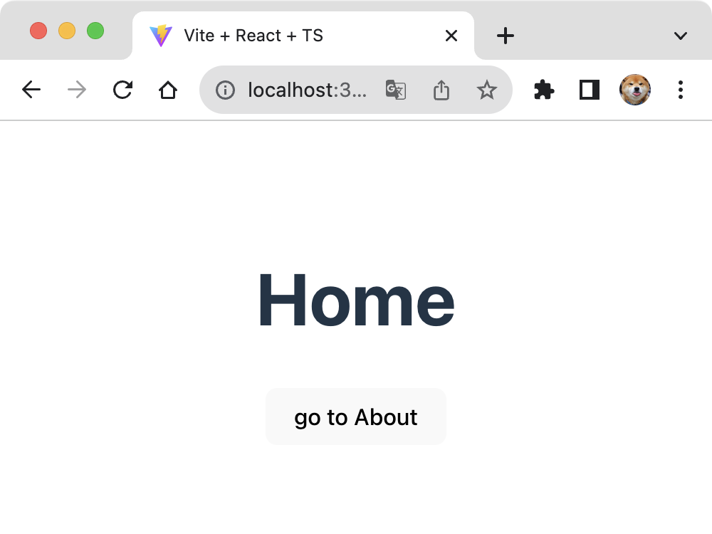
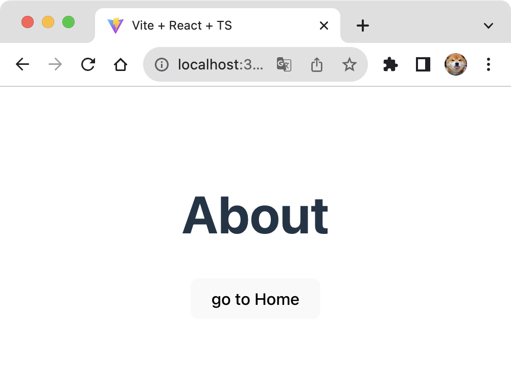

# SPA Router

React와 History API 사용하여 SPA Router 기능 직접 구현하기

## 요구사항

1. 해당 주소로 진입했을 때 아래 주소에 맞는 페이지가 렌더링 되어야 한다.
* `/` -> `root` 페이지
* `/about` -> `about` 페이지
2. 버튼을 클릭하면 해당 페이지로, 뒤로 가기 버튼을 눌렀을 때 이전 페이지로 이동해야 한다.
* 힌트 `window.onpopstate`, `window.location.pathname` History API(`pushState`)
3. Router, Route 컴포넌트를 구현해야 하며, 형태는 아래와 같아야 한다.
```tsx
ReactDOM.createRoot(container).render(
  <Router>
    <Route path="/" component={<Root />} />
    <Route path="/about" component={<About />} />
  </Router>
);
```
4. 최소한의 push 기능을 가진 useRouter Hooks을 작성한다.
```tsx
const { push } = useRouter();
```
5. 스크린샷
* Root 경로

- About 경로


## 구현
`<Router>` -> `<Routes>` -> `<Route>`의 구조로 되어 있다.

### Route

`<Route>` 컴포넌트는 `path`와 `component` props를 가지고 있으며 어떠한 역할도 하지 않는다. `<Routes>` 컴포넌트 안에서만 사용될 수 있게 에러를 던지는 역할만 한다. [react-router](https://github.com/remix-run/react-router)에서 구현한 방식과 동일한 방식으로 구현하였다.

### Routes

현재 라우터의 경로와 일치하는 컴포넌트를 렌더링 하는 역할을 한다. `children`을 순회하면서 유효한 엘리먼트인지 확인하고 현재 경로와 일치하는지 확인한 후에 `<Route>` props의 `component`를 클론해서 렌더링하게 구현하였다. queryString, pathVariable 등은 제외하고 단순히 경로가 일치하는지만 확인하게 구현하였다.

### Router

Context API를 사용해서 현재 경로(`window.location.pathname`)의 상태를 관리하는 역할을 한다. 또한 `push` 함수를 제공해서 라우터를 이동시킬 수 있게 하였고, 뒤로가기 이벤트(`popstate`)가 발생했을 때 현재 경로의 상태를 변경시켜서 리렌더링이 발생할 수 있게 구현하였다.

`useRouter()` hooks를 만들어 하위 컴포넌트에서 라우터 상태에 접근할 수 있게 구현하였다.